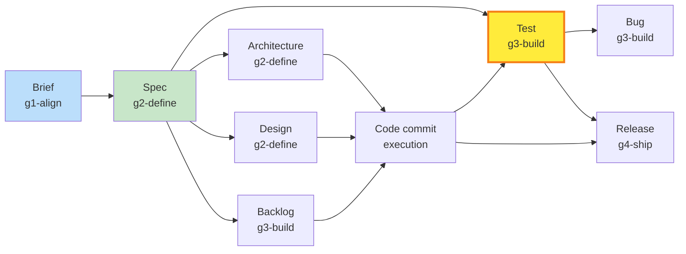

<div align="center">

# CSK CLI

**Company Skill Kit — scaffold, version, validate, and trace artifacts on a 5-gate spine**

[](https://github.com/EIgentLab/csk-cli/blob/main/LICENSE)
[](https://go.dev/)

[Install](#install) · [Quick Start](#quick-start) · [Commands](#commands) · [Workflow Guide](#workflow-guide) · [Document Lineage](#document-lineage) · [Skills & Agents](#skills--agents) · [Artifact Index](#artifact-index) · [Development](#development)

</div>

---

## What is CSK CLI?

`csk` is the command-line companion to the **Company Skill Kit (CSK)** — **14 skills + 10 role-based agents** built on **one universal 5-gate spine** (`G1 ALIGN → G2 DEFINE → G3 BUILD&VERIFY → G4 SHIP`; `G5 OPERATE` deferred). It works identically for a solo project and a 10-person team.

The CLI **owns all structure & lifecycle**; the 14 skills own **content** only.

| Capability | What it means |
|---|---|
| **Own the lifecycle** | `csk new` scaffolds a doc-as-folder with canonical frontmatter; `csk status` runs the state machine; `csk revise` versions + backs up; `csk validate` gates. Skills never hand-edit lifecycle fields. |
| **Install & manage** | Ships embedded skills/agents — `csk install` drops them into `.claude/`; `csk rule sync` injects the `<csk-rule>` operating contract into `./CLAUDE.md` |
| **Index & trace** | Scans gate dirs (`g1-align … g4-ship`), indexes every artifact, computes traceability from `derives_from` (`csk trace` / `csk rtm`) |
| **Visualization & search** | Ripgrep-powered search, Mermaid generation (graph / RTM / trace), orphan + broken-ref detection — all from the CLI |

---

## Install

### macOS / Linux — curl

```bash
curl -fsSL https://raw.githubusercontent.com/EIgentLab/csk-cli/dev-v1/scripts/install.sh | bash
```

Installs to `~/.local/bin` (no `sudo` required). Automatically adds `~/.local/bin` to your shell `PATH` using idempotent block markers.

System-wide install:

```bash
curl -fsSL https://raw.githubusercontent.com/EIgentLab/csk-cli/dev-v1/scripts/install.sh | bash -s -- --install-dir /usr/local/bin
```

Skip auto-add to `PATH` or install a specific version:

```bash
curl -fsSL ... | bash -s -- --no-add-path
curl -fsSL ... | bash -s -- --version v0.1.0-alpha.1
```

### macOS / Linux — Homebrew

```bash
brew tap eigentlab/csk-cli https://github.com/EIgentLab/csk-cli
brew install csk
```

### Windows — Scoop

```powershell
scoop bucket add eigentlab https://github.com/EIgentLab/csk-cli
scoop install csk
```

### Manual download

Grab the binary for your platform from the [Releases](https://github.com/EIgentLab/csk-cli/releases) page.

### Verify

```bash
csk version
```

---

## Quick Start

```bash
csk install                                   # Install skills + agents into ./.claude/ (-g for ~/.claude)
csk rule sync                                 # Inject the <csk-rule> operating contract into ./CLAUDE.md
csk skills list                               # Explore the 14 skills

# Author an artifact (CLI owns structure; the skill fills the content):
csk new --type brief --slug checkout --title "Checkout Brief"   # → g1-align/brief-checkout/
# …fill the FILL[...] regions…
csk validate g1-align/brief-checkout          # structural gate
csk status g1-align/brief-checkout approved   # validate runs inline; CLI stamps + change_log

csk db rebuild && csk db verify               # build + CI gate
csk trace BRIEF-checkout                       # lineage; or `csk rtm --view coverage`
```

---

## Commands

### Lifecycle (CLI owns structure & lifecycle)

| Command | Description | Key flags |
|---|---|---|
| `csk new` | Scaffold a doc-as-folder `g<N>-<gate>/<type>-<slug>/`: main file (canonical frontmatter, `version 1.0.0`, `status draft`) + one stub per part. Atomic types (`bug`) → single flat file. | `--type`, `--slug`, `--title`, `--source-skill`, `--source-skill-version` |
| `csk status <file\|doc-dir>… <state>` | Move lifecycle state (legal state machine). `→ approved` runs `csk validate` inline. | `--reason` |
| `csk revise <file\|doc-dir>` | Backup + semver bump + `change_log`. `breaking` requires `--reason`. | `--type content\|wording\|typo\|breaking\|restore`, `--reason`, `--report`, `--restore-from` |
| `csk validate <file\|doc-dir>` | Structural gate (parts exist, no `FILL`, `source_skill_version` stamped, approved backed by `change_log`) | — |
| `csk rule sync` | Write/update the `<csk-rule>` operating-contract block in `./CLAUDE.md` | — |

Type → gate: `brief→g1-align`, `spec/architecture/design→g2-define`, `backlog/test/bug→g3-build`, `release→g4-ship`.

### Install & Manage

| Command | Description | Key flags |
|---|---|---|
| `csk install` | Install embedded skills & agents | `-g` global, `--keep` preserve conflicts |
| `csk uninstall` | Remove all installed assets | `-g` global |
| `csk update` | Re-install if binary version differs | `-g` global, `--dry-run` preview only |
| `csk list` | Show installed skills & agents from manifest | `-g` global |
| `csk version` | Print binary version | — |

### Artifact Index (scans gate dirs `g1-* … g5-*`)

| Command | Description | Key flags |
|---|---|---|
| `csk db rebuild` | Scan gate dirs (`g1-align … g4-ship`) → regenerate the index | `-v` verbose |
| `csk db verify` | Validate index integrity (drift, broken-refs) | — |
| `csk db stats` | Print artifact & ref statistics | — |
| `csk db list` | List artifacts by gate, status, or project | `--phase`, `--status`, `--project`, `--json` |

### Search & Lookup

| Command | Description | Key flags |
|---|---|---|
| `csk find <id>` | Look up artifact by ID | `--full` include body, `--json` |
| `csk refs <id>` | List cross-references for an artifact | `--in` / `--out` / `--all`, `--json` |
| `csk orphans` | List artifacts with no incoming or outgoing refs | `--exclude-type`, `--include-all`, `--json` |
| `csk broken-refs` | Validate all refs | `--json` |
| `csk search "<query>"` | Ripgrep across gate-dir artifacts | `--type`, `--status`, `--limit`, `--case-sensitive`, `--json` |

### Skills Registry

| Command | Description | Key flags |
|---|---|---|
| `csk skills list` | Enumerate installed skills (the 14 roster) | `--phase`, `--owner`, `--json` |
| `csk skills search "<query>"` | Rank skills by keyword + owner | `--phase`, `--owner`, `--limit`, `--json` |

### Traceability & Visualization

| Command | Description | Key flags |
|---|---|---|
| `csk trace <id>` | Upstream + downstream lineage, computed from `derives_from` | `--format markdown\|csv` |
| `csk trace link` | Record a commit↔story execution link (used by `csk-code`/`csk-bugfix`) | `--story`, `--commit`, `--list` |
| `csk rtm` | Recompute traceability: `coverage`, `impact`, or `code` (story↔commit links) | `--view coverage\|impact\|code`, `--format markdown\|csv` |
| `csk viz graph` | Mermaid flowchart of artifact references | `--type` filter, `--out` file |
| `csk viz trace <id>` | Mermaid trace diagram from a single artifact | `--depth` max depth, `--out` file |
| `csk export` | Export the artifact index as an HTML dashboard | `--html`, `--open`, `--out` path |

> **Aliases:** `csk graph` → `csk viz graph`, `csk rtm trace` → `csk viz trace`

### Watch Mode

| Command | Description | Key flags |
|---|---|---|
| `csk watch` | Monitor gate dirs (`g1-* … g5-*`) for changes, auto-rebuild indexes | `-d` debounce ms, `-q` quiet |

---

## Workflow Guide

CSK runs on **one universal 5-gate spine**. Depth flexes *inside* each document (lo-fi ↔ detailed) — the same gate serves a solo brief and a full enterprise spec. There are no per-phase skill sets to learn.

### The 5-Gate Spine

```
G1 ALIGN ──▶ G2 DEFINE ──▶ G3 BUILD&VERIFY ──▶ G4 SHIP ──▶ (G5 OPERATE, deferred)
 g1-align      g2-define        g3-build           g4-ship
```

### Gates → skills & exit

| Gate | Folder | Artifact skill(s) | Key commands | Exit |
|---|---|---|---|---|
| **G1 ALIGN** | `g1-align/` | `csk-brief` | `csk new --type brief …` → `csk status … approved` | Brief approved |
| **G2 DEFINE** | `g2-define/` | `csk-spec` · `csk-architecture` · `csk-design` | `csk new --type spec/architecture/design …` → `csk validate` | Spec/arch/design approved |
| **G3 BUILD&VERIFY** | `g3-build/` | `csk-backlog` · `csk-test` · `csk-bug` + exec `csk-scout/code/debug/bugfix` | `csk watch` + `csk db rebuild` + `csk trace` | DoD met |
| **G4 SHIP** | `g4-ship/` | `csk-release` | `csk broken-refs` + `csk viz trace` | Release sign-off |

### Typical Workflow Session

```bash
# Author + approve an artifact at a gate:
csk new --type spec --slug checkout --title "Checkout Spec"   # → g2-define/spec-checkout/
# …fill FILL[...] regions…
csk validate g2-define/spec-checkout                          # structural gate
csk status g2-define/spec-checkout approved                   # validate runs inline; CLI stamps

# Keep the index + traceability fresh:
csk db rebuild && csk db verify
csk trace SPEC-checkout                  # upstream + downstream lineage
csk rtm --view coverage                  # traceability as a computed view

# Visualize / catch disconnects:
csk viz graph --out docs/artifact-graph.mmd
csk orphans
csk broken-refs

# Edit safely (never overwrite in place):
csk revise g2-define/spec-checkout --type content --reason "add export FR"
```

---

<a id="document-lineage"></a>
## Document Lineage (RTM as a computed view)

Each artifact declares its upstream via `derives_from`; traceability is **computed** from that field — there is no hand-maintained RTM file. `csk trace <id>` walks one artifact's lineage; `csk rtm --view` recomputes coverage/impact across the project. Arrows = "derives from".


```mermaid
flowchart LR
    BRIEF[Brief<br/>g1-align]
    SPEC[Spec<br/>g2-define]
    ARCH[Architecture<br/>g2-define]
    DESIGN[Design<br/>g2-define]
    BACKLOG[Backlog<br/>g3-build]
    TEST[Test<br/>g3-build]
    CODE[Code commit<br/>execution]
    BUG[Bug<br/>g3-build]
    RELEASE[Release<br/>g4-ship]

    BRIEF --> SPEC
    SPEC --> ARCH & DESIGN
    SPEC --> BACKLOG
    SPEC --> TEST
    ARCH --> CODE
    DESIGN --> CODE
    BACKLOG --> CODE
    CODE --> TEST
    TEST --> BUG
    TEST --> RELEASE
    CODE --> RELEASE

    style SPEC fill:#c8e6c9
    style TEST fill:#ffeb3b,stroke:#f57f17,stroke-width:3px
    style BRIEF fill:#bbdefb
```

The **commit↔story** link plus `Test ↔ Spec ↔ Bug ↔ Release` lineage is the lightweight RTM backbone: every requirement traces to a test, every test back to a requirement — surfaced on demand via `csk rtm`.

### Gate → Artifact Mapping

| Gate | Upstream | Artifact (skill) | Feeds |
|------|----------|------------------|-------|
| **G1 ALIGN** | brief from idea/stakeholders | Brief (`csk-brief`) | G2 Spec |
| **G2 DEFINE** | Brief | Spec (`csk-spec`), Architecture (`csk-architecture`), Design (`csk-design`) | G3 Backlog/Test |
| **G3 BUILD&VERIFY** | Spec/Arch/Design | Backlog (`csk-backlog`), Test (`csk-test`), Bug (`csk-bug`) + code via execution skills | G4 Release |
| **G4 SHIP** | Build outputs | Release (`csk-release`) | (G5 Operate, deferred) |

---

## Skills & Agents

### 10 Role-Based Agents

Installed to `.claude/agents/`. Each persona orchestrates the 14-skill roster (no per-phase coupling):

| Agent | Role | Orchestrates |
|---|---|---|
| `csk-po` | Product Owner | csk-brief, csk-spec, csk-backlog, csk-release |
| `csk-pm` | Project Manager | csk-brief, csk-backlog, csk-spec |
| `csk-ba` | Business Analyst | csk-brief, csk-spec, csk-backlog, csk-test |
| `csk-ux-ui` | UX/UI Designer | csk-design, csk-brief, csk-spec |
| `csk-architect` | Software Architect | csk-architecture, csk-spec |
| `csk-tech-lead` | Tech Lead | csk-architecture, csk-spec, csk-test |
| `csk-fullstack-dev` | Full-Stack Developer | csk-code, csk-design, csk-architecture, csk-test, csk-bug |
| `csk-qa` | QA Engineer | csk-test, csk-bug, csk-release, csk-spec |
| `csk-devops` | DevOps Engineer | csk-backlog, csk-architecture |
| `csk-sm` | Scrum Master | csk-backlog, csk-brief, csk-spec |

### 14 Skills (3 archetypes)

Each skill is a `csk-{skill}/SKILL.md` with a guideline + checklist + example (no `template.md` — the CLI's `csk new` owns the scaffold). See [**SKILLS_REFERENCE.md**](./SKILLS_REFERENCE.md) for full details.

| Archetype | Skills |
|---|---|
| **Artifact (8)** | `csk-brief` (G1) · `csk-spec` · `csk-architecture` · `csk-design` (G2) · `csk-backlog` · `csk-test` · `csk-bug` (G3) · `csk-release` (G4) |
| **Execution (4)** | `csk-scout` · `csk-code` · `csk-debug` · `csk-bugfix` (drive work; no persisted artifact) |
| **Utility (2)** | `csk-conduct` (router) · `csk-validate` (pre-flight gate check) |

```bash
csk skills list                   # The 14 skills
csk skills list --owner architect # Architect-orchestrated skills
csk skills search "test"          # Fuzzy search by keyword
```

---

<a id="artifact-index"></a>
## Artifact Index

`csk new` creates a **doc-as-folder** per artifact under a gate dir; `csk` indexes those gate dirs:

```
.project/
├── g1-align/
│   └── brief-checkout/
│       ├── brief-checkout.md     # main node (canonical frontmatter, parts: [...])
│       ├── problem.md            # part stub (parent + part, FILL[...] regions)
│       └── …
├── g2-define/                    # spec-* / architecture-* / design-*
├── g3-build/                     # backlog-* / test-* / bug-* (bug = single flat file)
├── g4-ship/                      # release-*
├── _index/                       # CLI-built index (do not hand-edit)
└── .csk/
    ├── backup/                   # csk revise snapshots — LOCAL ONLY (gitignore; may hold secrets)
    └── change-reports/           # csk revise --report output
```

> **Gitignore.** Add `.project/.csk/backup/` (or all of `.project/.csk/`) to your `.gitignore` — it holds
> immutable revise snapshots that may capture secrets. The CLI ships a self-protecting `.csk/.gitignore`
> as a backstop.

Each main node carries canonical frontmatter — **lifecycle fields are written only by the CLI**:

```yaml
---
id: BRIEF-checkout
type: brief
title: "Checkout Brief"
status: draft                 # draft → review → approved → superseded|archived
version: 1.0.0                # bumped by `csk revise`
owners: [csk-po]
source_skill: csk-brief
source_skill_version: 1.0.0   # stamped by `csk new`; validate FAILs if absent
created: 2026-06-04T00:00:00Z
updated: 2026-06-04T00:00:00Z
derives_from: [ ]             # upstream → feeds `csk trace` / `csk rtm`
parts: [problem, users, scope, value]
change_log:
  - { version: 1.0.0, date: 2026-06-04, type: initial, reason: initial release }
---
```

### Index lifecycle

```bash
csk db rebuild          # Scan gate dirs → regenerate the index
csk watch               # Auto-rebuild on file changes
csk db verify           # Check drift, broken-refs, bidirectional mismatches
csk broken-refs         # Standalone broken-refs check
csk orphans             # Find disconnected artifacts
```

---

## Development

### Prerequisites

- Go 1.26.3+
- GoReleaser v2 (for releases)

### Build

```bash
make build              # Standard build
make garble             # Garble obfuscated build
make clean              # Remove artifacts
make release-snapshot   # Test GoReleaser locally
```

### Release Pipeline

1. Push a tag (`v*`) to `csk-cli`
2. GitHub Actions triggers GoReleaser
3. Binaries built for 5 platforms
4. Releases + Homebrew formula + Scoop manifest cross-pushed

### Project Structure

```
csk-cli/                          # This repo — distribution & installers
├── Formula/csk.rb                # Homebrew formula template
├── Bucket/csk.json               # Scoop manifest template
├── scripts/install.sh            # curl installer script
└── LICENSE
```

---

## License

EIgentLab Source License v1.0 — see [LICENSE](./LICENSE).